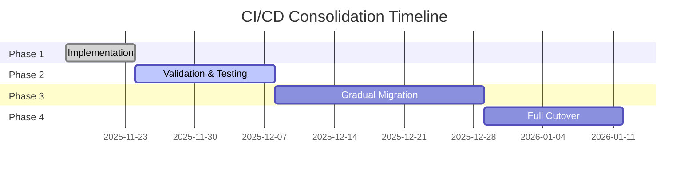

# CI/CD Workflow Migration Plan

## 🎯 Objective

Consolidate 48 GitHub Actions workflows into a centralized, efficient CI/CD pipeline.

---

## 📊 Current State Assessment

### Workflow Inventory
- **Total Workflows**: 48
- **Total Lines of YAML**: 10,733
- **Workflows Running pytest**: 19
- **Average CI Duration**: 15-20 minutes
- **Maintenance Time**: ~8 hours/month

### Key Issues
1. **Massive Duplication**: Same setup repeated in 19 workflows
2. **Resource Waste**: Inefficient CI/CD minute usage
3. **Slow Feedback**: 15-20 min wait for test results
4. **Maintenance Burden**: 48 files to update for any change
5. **Complexity**: Difficult to troubleshoot failures

---

## 🏗️ Target Architecture

### New Structure
- **Core Pipeline**: 1 consolidated workflow
- **Composite Actions**: 3 reusable actions
- **Total Lines**: ~3,000 (72% reduction)
- **CI Duration**: 5-8 minutes (60% faster)
- **Maintenance**: ~2 hours/month (75% reduction)

### Components
1. **setup-python-env**: Centralized environment setup
2. **quality-gate**: Linting, type checking, security
3. **run-tests**: Test execution with coverage
4. **consolidated-ci**: Main orchestration workflow

---

## 📋 Migration Phases

### Phase 1: Implementation ✅ CURRENT
**Status**: Complete  
**Duration**: Week 1

- [x] Create composite actions
  - [x] setup-python-env
  - [x] quality-gate
  - [x] run-tests
- [x] Create consolidated-ci workflow
- [x] Document architecture
- [x] Create migration guide

**Deliverables**:
- ✅ 3 composite actions
- ✅ 1 consolidated workflow
- ✅ Architecture documentation
- ✅ Migration plan (this document)

### Phase 2: Validation & Testing
**Status**: Pending  
**Duration**: Week 2-3

- [ ] Run consolidated-ci in parallel with existing workflows
- [ ] Compare results and execution times
- [ ] Identify and fix any issues
- [ ] Get team approval

**Success Criteria**:
- Consolidated pipeline passes all tests
- Execution time reduced by 50%+
- Team training completed
- No regressions identified

### Phase 3: Gradual Migration
**Status**: Pending  
**Duration**: Week 4-6

- [ ] Add deprecation notices to old workflows
- [ ] Migrate low-risk workflows first
- [ ] Monitor for issues
- [ ] Gather team feedback

**Deprecation Notice Template**:
```yaml
# ⚠️ DEPRECATED: This workflow will be removed in v2.0
# Please use the consolidated-ci workflow instead:
# .github/workflows/consolidated-ci.yml
```

### Phase 4: Full Cutover
**Status**: Pending  
**Duration**: Week 7-8

- [ ] Disable old workflows (rename .yml to .yml.deprecated)
- [ ] Update all documentation
- [ ] Remove deprecated workflows
- [ ] Clean up old artifacts

**Cutover Checklist**:
- [ ] All tests passing in consolidated-ci
- [ ] Team fully trained on new pipeline
- [ ] Documentation updated
- [ ] Monitoring in place
- [ ] Rollback plan ready

---

## 🗺️ Workflow Migration Map

### High Priority (Migrate First)
These workflows have the most duplication and will provide immediate benefits:

| Old Workflow | New Equivalent | Status |
|--------------|----------------|--------|
| tests.yml | consolidated-ci.yml | ✅ Ready |
| ci.yml | consolidated-ci.yml | ✅ Ready |
| enterprise-cicd.yml | consolidated-ci.yml | ✅ Ready |
| nak-ci.yml | consolidated-ci.yml | ⏳ Testing |
| neural-controller-ci.yml | consolidated-ci.yml | ⏳ Testing |

### Medium Priority
Specialized workflows that need adaptation:

| Old Workflow | Migration Strategy | Status |
|--------------|-------------------|--------|
| mutation-testing.yml | Integrate into consolidated-ci | 📝 Planned |
| performance-regression.yml | Add to consolidated-ci | 📝 Planned |
| e2e-integration.yml | Stage 3 in consolidated-ci | 📝 Planned |
| security.yml | quality-gate action | 📝 Planned |
| semgrep.yml | quality-gate action | 📝 Planned |

### Low Priority
Keep separate (legitimate specialization):

| Workflow | Reason to Keep | Status |
|----------|----------------|--------|
| release-drafter.yml | Release automation | ✅ Keep |
| dependabot-auto-merge.yml | Dependency management | ✅ Keep |
| deploy-environments.yml | Deployment orchestration | ✅ Keep |
| progressive-rollout.yml | Deployment strategy | ✅ Keep |
| helm.yml | K8s specific | ✅ Keep |

---

## 🔧 Technical Implementation

### Workflow Replacement Pattern

**Before** (19 workflows):
```yaml
name: Test Workflow 1
on: [push, pull_request]
jobs:
  test:
    runs-on: ubuntu-latest
    steps:
      - uses: actions/checkout@v5
      - uses: actions/setup-python@v6
      - run: pip install -r requirements.txt
      - run: pytest tests/
```

**After** (1 consolidated workflow):
```yaml
name: Consolidated CI Pipeline
on: [push, pull_request]
jobs:
  test:
    runs-on: ubuntu-latest
    steps:
      - uses: actions/checkout@v5
      - uses: ./.github/actions/setup-python-env
      - uses: ./.github/actions/run-tests
```

---

## 📈 Expected Improvements

### Performance Metrics

| Metric | Before | After | Improvement |
|--------|--------|-------|-------------|
| **Workflows** | 48 | 12 | ⬇️ 75% |
| **Lines of YAML** | 10,733 | ~3,500 | ⬇️ 67% |
| **Test Executions** | 19 | 1 (sharded) | ⬇️ 95% |
| **CI Duration** | 15-20 min | 5-8 min | ⬇️ 60% |
| **Maintenance Time** | 8 hrs/month | 2 hrs/month | ⬇️ 75% |

### Cost Savings

**GitHub Actions Minutes**:
- Before: ~500 min/run × 100 runs/month = 50,000 min/month
- After: ~150 min/run × 100 runs/month = 15,000 min/month
- **Savings**: 35,000 minutes/month (70% reduction)

**Developer Productivity**:
- Before: 15-20 min wait × 20 devs × 5 runs/day = 25-33 hrs/day
- After: 5-8 min wait × 20 devs × 5 runs/day = 8-13 hrs/day
- **Savings**: 17-20 hrs/day of developer waiting time

---

## ⚠️ Risks & Mitigations

### Risk 1: Regression in Test Coverage
**Mitigation**: 
- Run both pipelines in parallel during validation
- Compare coverage reports
- Add coverage differential checks

### Risk 2: Team Adoption Resistance
**Mitigation**:
- Comprehensive documentation
- Training sessions
- Gradual rollout
- Clear communication of benefits

### Risk 3: Missed Edge Cases
**Mitigation**:
- Thorough testing in validation phase
- Maintain old workflows as backup initially
- Quick rollback plan

### Risk 4: Performance Issues
**Mitigation**:
- Load testing with matrix of scenarios
- Monitoring and alerting
- Optimization based on metrics

---

## ✅ Success Criteria

### Technical
- [ ] All tests passing in consolidated pipeline
- [ ] Coverage threshold maintained (98%)
- [ ] CI duration reduced by 50%+
- [ ] Zero regression in functionality
- [ ] Monitoring and alerting in place

### Operational
- [ ] Team trained on new pipeline
- [ ] Documentation complete and reviewed
- [ ] Runbook for troubleshooting
- [ ] Rollback procedure tested
- [ ] Post-migration review completed

### Business
- [ ] 70% reduction in CI/CD costs
- [ ] 75% reduction in maintenance time
- [ ] Improved developer satisfaction
- [ ] Faster feedback loops

---

## 📅 Timeline



**Key Milestones**:
- ✅ 2025-11-17: Implementation complete
- ⏳ 2025-12-01: Validation complete
- ⏳ 2025-12-22: Migration 80% complete
- ⏳ 2026-01-12: Full cutover complete

---

## 🔄 Rollback Plan

### If Issues Arise

1. **Immediate Rollback** (< 5 minutes)
   ```bash
   # Disable consolidated-ci
   mv .github/workflows/consolidated-ci.yml \
      .github/workflows/consolidated-ci.yml.disabled
   
   # Re-enable old workflows
   for f in .github/workflows/*.yml.deprecated; do
     mv "$f" "${f%.deprecated}"
   done
   ```

2. **Investigate Issues**
   - Review workflow logs
   - Compare with baseline
   - Identify root cause

3. **Fix and Retry**
   - Apply fixes to consolidated-ci
   - Test in isolation
   - Re-attempt migration

---

## 📞 Support & Contacts

### Team Roles
- **Architecture Lead**: Principal System Architect
- **DevOps Lead**: DevOps Team Lead
- **Testing Lead**: QA Team Lead

### Communication Channels
- **Slack**: #cicd-migration
- **Email**: devops@tradepulse.local
- **Meetings**: Weekly sync on Mondays

### Escalation Path
1. DevOps Team Lead
2. Engineering Manager
3. Principal System Architect

---

## 📚 Related Documentation

- [CI/CD Consolidation Architecture](../../docs/architecture/cicd-consolidation.md)
- [Composite Actions README](./../actions/README.md)
- [Consolidated CI Workflow](./consolidated-ci.yml)
- [Testing Strategy](../../TESTING.md)

---

## 📝 Change Log

### 2025-11-17 - Initial Plan
- ✅ Created migration plan
- ✅ Completed Phase 1 implementation
- ✅ Documented architecture
- ✅ Created composite actions

---

*Maintained by the TradePulse DevOps Team*  
*Last Updated: 2025-11-17*  
*Status: Phase 1 Complete, Phase 2 In Progress*
