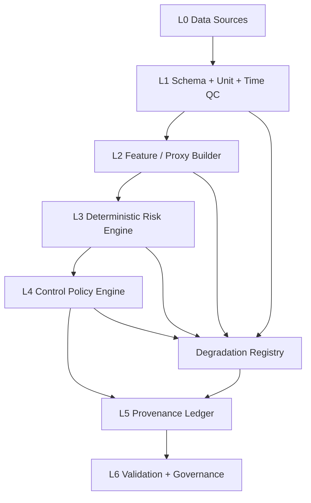

# Architecture



## Data plane

- `Observation`: atomic measurement event.
- `Feature`: normalized derived proxy.
- `RiskState`: composite CNS risk state.
- `ControlAction`: safe operational action.
- `ProvenanceRecord`: audit and traceability unit.
- `InferenceRun`: complete inference transaction.

## Control plane

- `config/risk_rules.yaml`: versioned thresholds and action mapping.
- `config/evidence_grades.yaml`: evidence hierarchy.
- `docs/traceability_matrix.csv`: requirement-to-protocol-to-test-to-evidence mapping.
- `schemas/`: strict data contracts.

## Determinism contract

```text
hash_input  = canonical_json(input)
hash_rules  = canonical_json(parsed_rules)
hash_engine = source_code_hash
run_hash = sha256(hash_input + hash_rules + hash_engine)
```

No hidden LLM calls, stochastic steps, unpinned rule loading, or implicit critical imputation are allowed in the production inference path.
