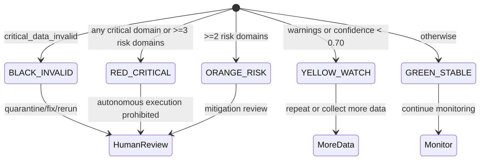

# State Diagram

```mermaid
stateDiagram-v2
    [*] --> BLACK_INVALID: critical_data_invalid
    [*] --> RED_CRITICAL: any critical domain or >=3 risk domains
    [*] --> ORANGE_RISK: >=2 risk domains
    [*] --> YELLOW_WATCH: warnings or confidence < 0.70
    [*] --> GREEN_STABLE: otherwise

    BLACK_INVALID --> HumanReview: quarantine/fix/rerun
    RED_CRITICAL --> HumanReview: autonomous execution prohibited
    ORANGE_RISK --> HumanReview: mitigation review
    YELLOW_WATCH --> MoreData: repeat or collect more data
    GREEN_STABLE --> Monitor: continue monitoring
```
