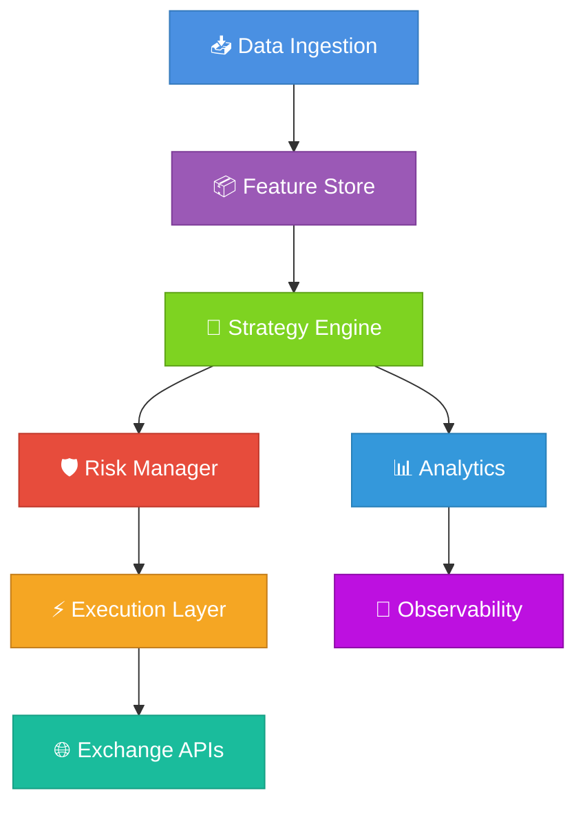

<div align="center">

# TradePulse

*Enterprise-Grade Algorithmic Trading Platform with Geometric Market Intelligence*

<br>

[](https://github.com/neuron7x/TradePulse/actions/workflows/tests.yml)
[](https://github.com/neuron7x/TradePulse/actions/workflows/ci.yml)
[](LICENSE)
[](https://www.python.org/)

**TradePulse** is a production-grade algorithmic trading platform combining advanced geometric market indicators with enterprise reliability for quantitative researchers, algorithmic traders, and financial institutions.

[Quick Start](#-quick-start) • [Features](#-feature-highlights) • [Documentation](#-documentation) • [Contributing](#-contributing)

</div>

---

## 📋 Table of Contents

- [Why TradePulse?](#-why-tradepulse)
- [Feature Highlights](#-feature-highlights)
- [System Architecture](#-system-architecture)
- [Quick Start](#-quick-start)
- [Usage Examples](#-usage-examples)
- [TACL: Thermodynamic Control Layer](#-tacl-thermodynamic-autonomic-control-layer)
- [Testing & Quality](#-testing--quality)
- [Performance](#-performance)
- [Configuration](#-configuration)
- [Deployment](#-deployment)
- [Use Cases](#-use-cases)
- [Project Status & Roadmap](#-project-status--roadmap)
- [Contributing](#-contributing)
- [License](#-license)
- [Disclaimer](#-disclaimer)

---

## 🎯 Why TradePulse?

### For Quantitative Researchers
- **Geometric Market Indicators**: Kuramoto oscillators, Ricci flow, entropy measures for deep market analysis
- **Research → Production Pipeline**: Seamless transition from research to live trading
- **Advanced Backtesting**: Event-driven engine with walk-forward optimization and property-based testing

### For Algorithmic Traders
- **Multi-Exchange Support**: Binance, Coinbase, Kraken, Alpaca, and more via CCXT
- **Live Trading**: Real-time signal generation and execution with built-in risk management
- **Observability**: Prometheus metrics, OpenTelemetry tracing, and comprehensive logging

### For Infrastructure Engineers
- **Enterprise-Grade**: Production-ready with security compliance (NIST, ISO 27001)
- **Scalable Architecture**: Event-driven design, GPU acceleration, Kubernetes-ready
- **Comprehensive Testing**: 98% coverage target with unit, integration, property-based, and fuzz testing

---

## ✨ Feature Highlights

### 🧮 Geometric Market Intelligence

**Kuramoto Oscillators** — Detect synchronization patterns in market dynamics  
**Ricci Flow** — Measure geometric curvature for regime detection  
**Entropy Measures** — Information-theoretic market analysis  
**Multi-Scale Analysis** — Fractal pattern recognition across timeframes  

Code: [`core/indicators/`](core/indicators/)

### 📊 Backtesting & Simulation

**Event-Driven Engine** — Microsecond-latency simulation architecture  
**Portfolio Management** — Multi-asset portfolio optimization and rebalancing  
**Risk Management** — Pre-trade checks, position limits, drawdown protection  
**Walk-Forward Optimization** — Defense against overfitting  
**Property-Based Tests** — Hypothesis-driven strategy validation  

Code: [`backtest/`](backtest/), [`execution/`](execution/)

### ⚡ Live Trading & Integration

**Exchange Connectors** — CCXT, Alpaca, Polygon APIs  
**Execution Layer** — REST and WebSocket execution adapters  
**Runtime Layer** — Live trading orchestration and monitoring  
**Paper Trading** — Safe testing before live deployment  
**Kill Switch** — Emergency stop with secure admin API  

Code: [`execution/`](execution/), [`runtime/`](runtime/), [`interfaces/live_runner.py`](interfaces/live_runner.py)

### 🛡️ Observability & Safety

**Metrics** — Prometheus exporters for real-time monitoring  
**Tracing** — OpenTelemetry distributed tracing  
**Circuit Breakers** — Auto trading halt after failures  
**Audit Logging** — 400-day retention with compliance support  
**Health Checks** — Kubernetes-ready liveness and readiness probes  

Code: [`observability/`](observability/), [`infra/`](infra/)

### 🔐 Enterprise Security

**Security Framework** — 93 controls aligned with NIST SP 800-53 and ISO 27001  
**Secrets Management** — HashiCorp Vault and AWS Secrets Manager integration  
**Encrypted Storage** — AES-256 at rest, TLS 1.3 in transit  
**MFA Support** — Multi-factor authentication for admin operations  
**Compliance** — GDPR, CCPA, SEC, FINRA ready  

Code: [Security Documentation](docs/security/), [`SECURITY.md`](SECURITY.md)

### 🚀 Extensibility

**Strategy Plugins** — Easy integration of custom strategies  
**Custom Indicators** — Add your own technical or geometric indicators  
**Rust Accelerators** — High-performance compute kernels  
**Neuro Modules** — Advanced neural trading components  

Code: [`strategies/`](strategies/), [`rust/tradepulse-accel/`](rust/tradepulse-accel/), [`hydrobrain_v2/`](hydrobrain_v2/), [`rl/`](rl/)

---

## 🏗️ System Architecture



### Key Modules

| Module | Path | Language | Purpose |
|--------|------|----------|---------|
| **Core Indicators** | `core/indicators/` | Python | Geometric and technical indicators |
| **Backtest Engine** | `backtest/` | Python | Event-driven backtesting |
| **Execution** | `execution/` | Python | Order execution and adapters |
| **Runtime** | `runtime/` | Python | Live trading orchestration |
| **Observability** | `observability/` | Python | Metrics, traces, dashboards |
| **UI Dashboard** | `ui/dashboard/` | TypeScript | Interactive web interface |
| **Rust Accelerators** | `rust/tradepulse-accel/` | Rust | High-performance compute |
| **HydroBrain v2** | `hydrobrain_v2/` | Python | Advanced neural components |
| **RL Module** | `rl/` | Python | Reinforcement learning strategies |
| **TACL** | `tacl/` | Python | Thermodynamic control layer |

📖 **Full Architecture**: [docs/ARCHITECTURE.md](docs/ARCHITECTURE.md)

---

## 🚀 Quick Start

### Prerequisites

- **Python** 3.11 or 3.12 ([Download](https://www.python.org/downloads/))
- **Git** 2.30+ for version control
- **Docker** (optional, for containerized deployment)

### Installation

```bash
# Clone the repository
git clone https://github.com/neuron7x/TradePulse.git
cd TradePulse

# Create and activate virtual environment
python -m venv .venv
source .venv/bin/activate  # On Windows: .venv\Scripts\activate

# Install dependencies with security constraints
pip install --upgrade pip
pip install -c constraints/security.txt -r requirements.lock

# Configure environment variables
cp .env.example .env
# Edit .env with your settings (see SETUP.md for details)
```

📖 **Detailed Setup**: [SETUP.md](SETUP.md)

### Your First Analysis

```bash
# Run the quick start example
PYTHONPATH=. python examples/quick_start.py
```

**Expected output:**
```
=== TradePulse Market Analysis ===
----------------------------------------
Market Phase:     transition
Confidence:       0.893
Entry Signal:     0.000
----------------------------------------

📊 Interpretation:
  • Market is transitioning between regimes
  • High confidence (89.3%) in current phase

✅ Analysis complete!
```

> **Note:** Use `PYTHONPATH=.` to ensure Python can find the local modules. On Windows PowerShell: `$env:PYTHONPATH='.'; python examples/quick_start.py`

### Interactive Dashboard

```bash
# Launch the Streamlit dashboard (install streamlit first: pip install streamlit)
PYTHONPATH=. streamlit run interfaces/dashboard_streamlit.py
```

> **Note:** The dashboard requires streamlit to be installed. It provides interactive market analysis and visualization.

📖 **Dashboard Guide**: [docs/ui_logical_structure.md](docs/ui_logical_structure.md)

---

## 💻 Usage Examples

### Basic Market Analysis

```python
import numpy as np
import pandas as pd
from core.indicators.kuramoto_ricci_composite import TradePulseCompositeEngine

# Generate sample market data
index = pd.date_range("2024-01-01", periods=720, freq="5min")
prices = 100 + np.cumsum(np.random.normal(0, 0.6, 720))
volume = np.random.lognormal(9.5, 0.35, 720)
bars = pd.DataFrame({"close": prices, "volume": volume}, index=index)

# Analyze market regime
engine = TradePulseCompositeEngine()
snapshot = engine.analyze_market(bars)

print(f"📊 Phase: {snapshot.phase.value}")
print(f"🎯 Confidence: {snapshot.confidence:.3f}")
print(f"📈 Entry Signal: {snapshot.entry_signal:.3f}")
```

### Backtesting a Strategy

```python
import numpy as np
from backtest.event_driven import EventDrivenBacktestEngine
from core.indicators import KuramotoIndicator

# Generate price series
rng = np.random.default_rng(seed=42)
prices = 100 + np.cumsum(rng.normal(0, 1, 500))

# Define indicator and signal function
indicator = KuramotoIndicator(window=80, coupling=0.9)

def kuramoto_signal(series: np.ndarray) -> np.ndarray:
    order = indicator.compute(series)
    signal = np.where(order > 0.75, 1.0, np.where(order < 0.25, -1.0, 0.0))
    warmup = min(indicator.window, signal.size)
    signal[:warmup] = 0.0
    return signal

# Run backtest
engine = EventDrivenBacktestEngine()
result = engine.run(
    prices,
    kuramoto_signal,
    initial_capital=100_000,
    strategy_name="kuramoto_demo",
)

print(f"💰 PnL: ${result.pnl:,.2f}")
print(f"📉 Max Drawdown: {result.max_dd:.2%}")
print(f"📊 Trades: {result.trades}")
```

### CLI Analysis

```bash
# Analyze CSV data
python -m interfaces.cli analyze \
    --csv data/sample.csv \
    --window 200 \
    --price-col close

# Generate sample data
python -m interfaces.cli generate \
    --output data/synthetic.csv \
    --bars 1000
```

📖 **CLI Reference**: [docs/tradepulse_cli_reference.md](docs/tradepulse_cli_reference.md)

---

## 🌡️ TACL: Thermodynamic Autonomic Control Layer

TACL is a self-regulating control system that manages the TradePulse topology as a thermodynamic system.

### Key Features

- **Free Energy Measurement**: Tracks system latency, coherency, and resource costs
- **Evolutionary Reconfiguration**: Uses GA/RL to optimize service connections
- **Protocol Hot-Swap**: Dynamic switching between RDMA, CRDT, gRPC, shared memory
- **Safety Guarantee**: Monotonic free energy descent — no change increases F without human override

### Technical Details

- **Classification**: TRL7 (post-staging)
- **Adaptation**: GA/RL with runtime monotonic gates
- **Audit**: Full decision logging for 7-year compliance
- **Crisis Handling**: Adaptive recovery with multiple severity modes

📖 **TACL Documentation**: [docs/TACL.md](docs/TACL.md), [`tacl/`](tacl/), [`runtime/thermo_controller.py`](runtime/thermo_controller.py)

---

## 🧪 Testing & Quality

TradePulse maintains comprehensive test coverage with multiple testing strategies:

### Test Types

- **Unit Tests**: Module-level validation (`tests/unit/`)
- **Integration Tests**: End-to-end workflows (`tests/integration/`)
- **Property-Based Tests**: Hypothesis-driven testing (`tests/property/`)
- **Fuzz Tests**: Adversarial input testing (`tests/fuzz/`)
- **Contract Tests**: API schema validation (`tests/contracts/`)
- **Mutation Testing**: Test suite quality assurance

### Running Tests

```bash
# Run all tests
pytest tests/

# Fast feedback loop (skip slow tests)
pytest tests/ -m "not slow"

# With coverage report
pytest tests/ --cov=core --cov=backtest --cov=execution --cov-report=html

# Property-based tests only
pytest tests/property/

# Mutation testing
mutmut run --use-coverage
```

### Coverage Status

**Target**: 98% for v1.0 release (configured in pyproject.toml)  
**Current CI Gate**: 80% minimum while Kuramoto/Ricci suites stabilize  
**Module Targets**: backtest (100% ✅), execution (100% ✅), core modules (90-95%)

📖 **Testing Guide**: [TESTING.md](TESTING.md)

---

## ⚡ Performance

TradePulse is designed for low-latency, high-throughput trading operations.

### Design Goals

- **Backtesting**: 1M+ bars/second throughput
- **Live Trading**: Sub-5ms order latency (exchange dependent)
- **Signal Generation**: Sub-1ms with cached indicators
- **Memory**: ~200MB steady-state for live trading
- **GPU Acceleration**: 10-50x speedup on CUDA-enabled operations

### Benchmarks

Performance benchmarks are maintained in the `benchmarks/` directory and validated through CI:

```bash
# Run performance benchmarks
pytest tests/performance/test_indicator_benchmarks.py --benchmark-enable

# Generate performance report
python scripts/performance/generate_replay_report.py \
    --output-dir reports/performance \
    --generate-charts
```

📖 **Performance Guide**: [PERFORMANCE_REGRESSION_GUIDE.md](PERFORMANCE_REGRESSION_GUIDE.md)

> **Note**: Actual performance depends on hardware, dataset size, and configuration. Run benchmarks on your system for accurate measurements.

---

## ⚙️ Configuration

TradePulse uses **Hydra** for flexible, composable configuration management.

### Configuration Structure

TradePulse uses three configuration directories, each with a specific purpose:

- **`conf/`** — Hydra framework configs and experiment settings
- **`config/`** — Core neuromodulator and thermodynamic system configs
- **`configs/`** — Application and service-level configurations
- **`envs/`** — Environment-specific settings
- **`.env`** — Environment variables (not committed)

For detailed information about each directory's purpose and usage, see [Configuration Structure Guide](docs/architecture/configuration_structure.md).

### Example Configuration

```yaml
# config.yaml
strategy:
  name: momentum
  capital: 100000

data:
  source: binance
  symbols: [BTC/USDT, ETH/USDT]
  timeframe: 1h

execution:
  slippage: 0.001
  commission: 0.001

risk:
  max_position_pct: 0.2
  stop_loss_pct: 0.02
```

### Command-Line Overrides

```bash
# Override configuration from command line
tradepulse run strategy.capital=200000 data.timeframe=4h
```

📖 **Configuration Guide**: [docs/configuration.md](docs/configuration.md)

---

## 🚀 Deployment

### Docker Compose (Development & Staging)

```bash
# Configure environment
cp .env.example .env
# Edit .env with your secrets

# Start services
docker compose up -d

# Check status
docker compose ps

# View logs
docker compose logs -f tradepulse
```

### Kubernetes (Production)

```bash
# Provision EKS cluster (Terraform)
terraform -chdir=infra/terraform/eks init
terraform -chdir=infra/terraform/eks workspace select production
terraform -chdir=infra/terraform/eks apply -var-file=environments/production.tfvars

# Deploy with Kustomize
kubectl apply -k deploy/kustomize/overlays/production
kubectl rollout status deployment/tradepulse-api -n tradepulse-production
```

📖 **Deployment Guide**: [DEPLOYMENT.md](DEPLOYMENT.md)

---

## 🎯 Use Cases

### Quantitative Researcher

```python
# Multi-scale indicator composition
from tradepulse.indicators import MultiscaleKuramoto

indicator = MultiscaleKuramoto(
    scales=[5, 15, 60],  # Multi-timeframe analysis
    coupling=0.7,
)

# Automatic feature versioning
signals = indicator.compute(data, version="v2.1.0")
```

**Use for**: Strategy development, indicator research, pattern discovery, hypothesis testing

### Algorithmic Trader

```python
# Real-time signal generation
from tradepulse.live import LiveTrader

trader = LiveTrader(
    strategy=your_strategy,
    exchange="binance",
    mode="paper",  # Safe testing before live
)
trader.start()
```

**Use for**: Fast execution, real-time signals, live trading, mobile alerts

### Infrastructure Engineer

```python
# Enterprise risk management
from tradepulse.risk import RiskManager

risk_manager = RiskManager(
    max_position_size=100_000,
    max_leverage=3.0,
    stop_loss_pct=0.02,
    compliance_checks=["mifid2", "position_limits"],
)
```

**Use for**: Compliance, portfolio management, risk control, multi-strategy orchestration

---

## 📈 Project Status & Roadmap

### Current Version: v0.1.0

**Status**: Beta — Core functionality stable, live trading in active development

### Component Maturity

| Component | Status | Stability |
|-----------|--------|-----------|
| **Core Engine** | ✅ Production Ready | Stable |
| **Indicators (50+)** | ✅ Production Ready | Stable |
| **Backtesting** | ✅ Production Ready | Stable |
| **Live Trading** | 🔄 Beta | Active Development |
| **Web Dashboard** | 🚧 Alpha | Early Preview |
| **Documentation** | 🔄 In Progress | 85% Complete |

### Development Roadmap

- **Q1 2025**: Complete live trading module, finalize dashboard
- **Q2 2025**: Options & derivatives support
- **Q3 2025**: Multi-asset portfolio optimization
- **Q4 2025**: v1.0 GA release

📖 **Full Roadmap**: [docs/roadmap.md](docs/roadmap.md)  
📰 **Changelog**: [CHANGELOG.md](CHANGELOG.md)  
📋 **Product Planning**: [PRODUCT_PAIN_SOLUTION.md](PRODUCT_PAIN_SOLUTION.md)

---

## 🤝 Contributing

We welcome contributions! Whether bug fixes, new features, or documentation improvements — every contribution matters.

### Quick Start for Contributors

```bash
# Setup development environment
git clone https://github.com/neuron7x/TradePulse.git
cd TradePulse
python -m venv .venv
source .venv/bin/activate
pip install -c constraints/security.txt -r requirements-dev.lock
pre-commit install

# Run quality checks
ruff check .     # Lint code
pytest           # Run tests
```

### First-Time Contributors

1. Browse [**good first issues**](https://github.com/neuron7x/TradePulse/issues?q=is%3Aissue+is%3Aopen+label%3A%22good+first+issue%22)
2. Read the [**Contributing Guide**](CONTRIBUTING.md)
3. Join our [**GitHub Discussions**](https://github.com/neuron7x/TradePulse/discussions)
4. Submit your first PR!

📖 **Contributing Guide**: [CONTRIBUTING.md](CONTRIBUTING.md)  
🤝 **Code of Conduct**: [CODE_OF_CONDUCT.md](CODE_OF_CONDUCT.md)

---

## 📚 Documentation

### Getting Started

- [⚙️ Environment Setup](SETUP.md) — Development environment guide
- [🚀 Quickstart Guide](docs/quickstart.md) — Step-by-step tutorials
- [🖥️ User Interaction Guide](docs/USER_INTERACTION_GUIDE.md) — CLI, Dashboard, API

### Technical Documentation

- [🏗️ Architecture Overview](docs/ARCHITECTURE.md) — System design deep dive
- [📡 API Reference](docs/api.md) — Complete API documentation
- [📊 Indicator Library](docs/indicators.md) — Available indicators and usage
- [🚀 Deployment Guide](DEPLOYMENT.md) — Production rollouts

### Security & Operations

- [🔐 Security Framework](docs/security/) — Comprehensive security documentation
- [🛡️ Security Policy](SECURITY.md) — Vulnerability reporting
- [⚙️ Operational Artifacts](docs/OPERATIONAL_ARTIFACTS_INDEX.md) — Production ops guide
- [📋 Incident Playbooks](docs/incident_playbooks.md) — Response procedures

📖 **Full Documentation**: [docs/](docs/)

---

## 🌐 Community & Support

### Documentation
- [📖 User Guide](docs/quickstart.md)
- [📡 API Reference](docs/api.md)
- [❓ FAQ](docs/faq.md)
- [🔧 Troubleshooting](docs/troubleshooting.md)

### Community
- [💬 GitHub Discussions](https://github.com/neuron7x/TradePulse/discussions) — Q&A, ideas, show & tell
- [📚 Stack Overflow](https://stackoverflow.com/questions/tagged/tradepulse) — Tagged questions

### Issues
- [🐛 Bug Reports](https://github.com/neuron7x/TradePulse/issues/new?template=bug_report.md)
- [✨ Feature Requests](https://github.com/neuron7x/TradePulse/issues/new?template=feature_request.md)
- [🔒 Security Issues](SECURITY.md) — Private vulnerability reporting

---

## 📜 License

TradePulse is distributed under the **TradePulse Proprietary License Agreement (TPLA)**.

[](LICENSE)

The TPLA permits **internal, non-commercial evaluation and development use only**. Commercial usage requires a separate written agreement.

📄 **Full License**: [LICENSE](LICENSE)

---

## ⚠️ Disclaimer

> **⚠️ Trading involves substantial risk of loss and is not suitable for everyone.**

This software is provided for **educational and research purposes only**. Past performance does not guarantee future results. Always test strategies thoroughly in paper trading before risking real capital.

**Trade responsibly. Never invest more than you can afford to lose.**

---

## 🙏 Acknowledgments

TradePulse is built with love using open source technology:

**Core Stack**: Python, NumPy, pandas, FastAPI, Streamlit  
**Analytics**: SciPy, scikit-learn, PyTorch, Numba  
**Infrastructure**: Docker, Kubernetes, Prometheus, Redis  
**Inspired by**: Zipline, Backtrader, QuantLib

Special thanks to all [contributors](https://github.com/neuron7x/TradePulse/graphs/contributors) who have helped build TradePulse!

---

<div align="center">

**Made with ❤️ by the TradePulse Community**

[⬆️ Back to Top](#tradepulse)

© 2024 TradePulse Technologies. All rights reserved.

</div>
