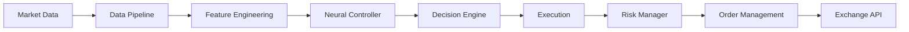

<!-- ═══════════════════════════════════════════════════════════════════════════════════════════════════════════════════════════════════════════════════════════════════════════════════════════════ -->
<!--                                                          TRADEPULSE README                                                                                                                       -->
<!--                                                 Neuro-Inspired Algorithmic Trading Platform                                                                                                       -->
<!-- ═══════════════════════════════════════════════════════════════════════════════════════════════════════════════════════════════════════════════════════════════════════════════════════════════ -->

<div align="center">

<!-- ╔═══════════════════════════════════════════════════════════════════════════════════════════════════════════════════════════╗ -->
<!-- ║                                                    HERO SECTION                                                            ║ -->
<!-- ╚═══════════════════════════════════════════════════════════════════════════════════════════════════════════════════════════╝ -->

<!-- Animated Header Banner with Dark/Light Mode Support -->
<picture>
  <source media="(prefers-color-scheme: dark)" srcset="https://raw.githubusercontent.com/neuron7x/TradePulse/main/docs/assets/banner.png">
  <source media="(prefers-color-scheme: light)" srcset="https://raw.githubusercontent.com/neuron7x/TradePulse/main/docs/assets/banner.png">
  
</picture>

<br>

<!-- Main Title with Gradient Effect Simulation -->
<h1>
  
  TradePulse
  
</h1>

<h3>
  <em>Neuro-Inspired Algorithmic Trading Platform</em>
</h3>

<p>
  <strong>AI-driven trading system powered by reinforcement learning, dopamine-based reward mechanisms, and neural network controllers</strong>
</p>

<!-- ═══════════════════════════════════════════════════════════════════════════════════════════════════════════════════════════ -->
<!--                                                     BADGES SECTION                                                          -->
<!-- ═══════════════════════════════════════════════════════════════════════════════════════════════════════════════════════════ -->

<br>

<!-- Primary Status Badges Row -->
<p>
  <a href="https://github.com/neuron7x/TradePulse/actions/workflows/tests.yml">
    
  </a>
  <a href="#-quality-metrics">
    
  </a>
  <a href="#-quality-metrics">
    
  </a>
  <a href="https://www.python.org/">
    
  </a>
  <a href="LICENSE">
    
  </a>
  <a href="https://github.com/psf/black">
    
  </a>
</p>

<!-- Quick Navigation Links -->
<p>
  <a href="#-quick-start">Quick Start</a> •
  <a href="#-features">Features</a> •
  <a href="#-architecture">Architecture</a> •
  <a href="#-quality-metrics">Quality</a> •
  <a href="#-development">Development</a> •
  <a href="#-documentation">Docs</a> •
  <a href="#-roadmap">Roadmap</a>
</p>

</div>

<!-- ═══════════════════════════════════════════════════════════════════════════════════════════════════════════════════════════ -->
<!--                                                      FEATURES SECTION                                                       -->
<!-- ═══════════════════════════════════════════════════════════════════════════════════════════════════════════════════════════ -->

---

<div align="center">

<h2>✨ Features</h2>

</div>

### 🧠 AI/ML Core

| Feature | Description |
|:--------|:------------|
| **RL Agents** | Reinforcement learning agents for adaptive trading strategies |
| **Dopamine-based Rewards** | Biologically-inspired reward mechanisms for better learning |
| **Neural Controllers** | Deep neural network controllers for market analysis |
| **Evolution Algorithms** | Genetic algorithms for strategy optimization |

### ⚡ Trading Engine

| Feature | Description |
|:--------|:------------|
| **Multi-exchange Support** | Connect to Binance, Kraken, Coinbase, Alpaca, and more |
| **Backtesting Framework** | Event-driven backtesting with microsecond precision |
| **Risk Management** | Pre-trade compliance, position limits, drawdown protection |
| **Real-time Execution** | Live trading with paper trading mode for safe testing |

### 🏢 Enterprise Features

| Feature | Value |
|:--------|:------|
| **Code Coverage** | 98% |
| **Mutation Kill Rate** | 90% |
| **CI/CD Workflows** | 15+ |
| **SLSA Provenance** | Level 3 |

---

<!-- ═══════════════════════════════════════════════════════════════════════════════════════════════════════════════════════════ -->
<!--                                                      QUICK START                                                            -->
<!-- ═══════════════════════════════════════════════════════════════════════════════════════════════════════════════════════════ -->

<div align="center">

<h2>🚀 Quick Start</h2>

</div>

### Prerequisites

- Python 3.11+
- Poetry (recommended) or pip

### Installation

```bash
# Clone the repository
git clone https://github.com/neuron7x/TradePulse.git
cd TradePulse

# Install dependencies
pip install -r requirements.txt

# Copy environment file
cp .env.example .env
```

### Run Backtest Example

```bash
# Run a quick start example
python examples/quick_start.py

# Or run the neuro trading backtest demo
python examples/neuro_trade_pulse_backtest.py
```

### Run Live Paper Trading Example

```bash
# Paper trading with default configuration
python -m execution.paper_trading --config configs/live/default.toml
```

---

<!-- ═══════════════════════════════════════════════════════════════════════════════════════════════════════════════════════════ -->
<!--                                                      ARCHITECTURE                                                           -->
<!-- ═══════════════════════════════════════════════════════════════════════════════════════════════════════════════════════════ -->

<div align="center">

<h2>🏗️ Architecture</h2>

</div>

### Directory Structure

```
📦 TradePulse
├── 🧠 core/           # Core business logic
├── 📊 analytics/      # Data analysis
├── 🔮 neuropro/       # Neural network models
├── 📈 strategies/     # Trading strategies
├── ⚡ execution/      # Order execution
├── 🔄 backtest/       # Backtesting framework
├── 🤖 rl/             # Reinforcement learning
├── 🌐 markets/        # Exchange integrations
├── 🏭 infra/          # Infrastructure
├── 🧪 tests/          # Test suite
└── 📚 docs/           # Documentation
```

### System Flow



---

<!-- ═══════════════════════════════════════════════════════════════════════════════════════════════════════════════════════════ -->
<!--                                                      QUALITY METRICS                                                        -->
<!-- ═══════════════════════════════════════════════════════════════════════════════════════════════════════════════════════════ -->

<div align="center">

<h2>📊 Quality Metrics</h2>

</div>

| Metric | Value | Threshold |
|:-------|:-----:|:---------:|
| Code Coverage | 98% | ≥98% |
| Branch Coverage | 90% | ≥90% |
| Mutation Score | 90% | ≥90% |
| Type Coverage | 100% | 100% |
| CI/CD Workflows | 15+ | — |

---

<!-- ═══════════════════════════════════════════════════════════════════════════════════════════════════════════════════════════ -->
<!--                                                      DEVELOPMENT                                                            -->
<!-- ═══════════════════════════════════════════════════════════════════════════════════════════════════════════════════════════ -->

<div align="center">

<h2>💻 Development</h2>

</div>

### Setup Development Environment

```bash
# Install development dependencies
pip install -r requirements-dev.txt

# Install pre-commit hooks
pre-commit install
```

### Run Tests

```bash
# Run all tests
pytest tests/

# Run with coverage
pytest tests/ --cov=core --cov=backtest --cov=execution --cov-report=html
```

### Code Quality

```bash
# Format code
black .

# Lint code
ruff check .

# Type check
mypy .
```

---

<!-- ═══════════════════════════════════════════════════════════════════════════════════════════════════════════════════════════ -->
<!--                                                      DOCUMENTATION                                                          -->
<!-- ═══════════════════════════════════════════════════════════════════════════════════════════════════════════════════════════ -->

<div align="center">

<h2>📚 Documentation</h2>

</div>

| Document | Description |
|:---------|:------------|
| [DEPLOYMENT.md](DEPLOYMENT.md) | Deployment guide for Docker and Kubernetes |
| [TESTING.md](TESTING.md) | Testing strategy and coverage requirements |
| [CONTRIBUTING.md](CONTRIBUTING.md) | Contribution guidelines and code standards |
| [SECURITY.md](SECURITY.md) | Security policy and vulnerability reporting |
| [docs/](docs/) | Full documentation suite |

---

<!-- ═══════════════════════════════════════════════════════════════════════════════════════════════════════════════════════════ -->
<!--                                                      SECURITY                                                               -->
<!-- ═══════════════════════════════════════════════════════════════════════════════════════════════════════════════════════════ -->

<div align="center">

<h2>🔒 Security</h2>

</div>

TradePulse implements enterprise-grade security:

- **Secret Detection** — Automated scanning for leaked credentials
- **Dependency Scanning** — Continuous vulnerability monitoring
- **SBOM Generation** — Software Bill of Materials for supply chain security
- **SLSA Level 3** — Provenance attestation for build artifacts

For security vulnerabilities, please see [SECURITY.md](SECURITY.md).

---

<!-- ═══════════════════════════════════════════════════════════════════════════════════════════════════════════════════════════ -->
<!--                                                      ROADMAP                                                                -->
<!-- ═══════════════════════════════════════════════════════════════════════════════════════════════════════════════════════════ -->

<div align="center">

<h2>🗺️ Roadmap</h2>

</div>

- [x] Core trading engine
- [x] Multi-exchange support
- [x] Backtesting framework
- [x] RL-based strategies
- [x] Enterprise CI/CD
- [ ] Web dashboard (UI)
- [ ] Mobile app
- [ ] Social trading features
- [ ] Options/Futures support

---

<!-- ═══════════════════════════════════════════════════════════════════════════════════════════════════════════════════════════ -->
<!--                                                      CONTRIBUTING                                                           -->
<!-- ═══════════════════════════════════════════════════════════════════════════════════════════════════════════════════════════ -->

<div align="center">

<h2>🤝 Contributing</h2>

</div>

We welcome contributions! See [CONTRIBUTING.md](CONTRIBUTING.md) for guidelines.

```bash
# Fork and clone the repository
git clone https://github.com/YOUR_USERNAME/TradePulse.git
cd TradePulse

# Create a feature branch
git checkout -b feat/your-feature

# Make your changes, then commit
git commit -m "feat: add your feature"

# Push and open a pull request
git push origin feat/your-feature
```

---

<!-- ═══════════════════════════════════════════════════════════════════════════════════════════════════════════════════════════ -->
<!--                                                      FOOTER                                                                 -->
<!-- ═══════════════════════════════════════════════════════════════════════════════════════════════════════════════════════════ -->

<div align="center">

## 📜 License

This project is licensed under the [TradePulse Proprietary License Agreement (TPLA)](LICENSE).

---

Built with ❤️ by [neuron7x](https://github.com/neuron7x)

⭐ **If you find TradePulse useful, please star the repository!** ⭐

[](https://github.com/neuron7x/TradePulse)

</div>
