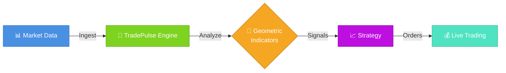
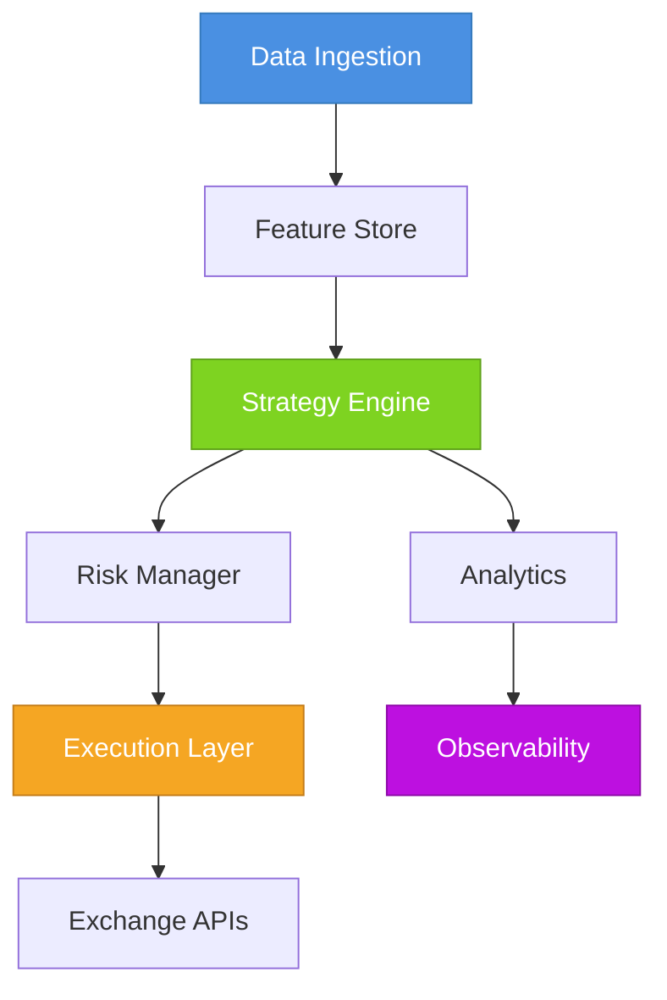

<div align="center">

<!-- Header Banner -->
<picture>
  <source media="(prefers-color-scheme: dark)" srcset="https://raw.githubusercontent.com/neuron7x/TradePulse/main/docs/assets/banner.png">
  <source media="(prefers-color-scheme: light)" srcset="https://raw.githubusercontent.com/neuron7x/TradePulse/main/docs/assets/banner.png">
  
</picture>

# 📈 TradePulse

### *Enterprise-Grade Algorithmic Trading Platform with Geometric Market Intelligence*

<p align="center">
  <strong>Transform market data into actionable insights using cutting-edge geometric indicators and production-ready infrastructure</strong>
</p>

---

<!-- Badges Section -->
<p align="center">
  <!-- Build Status -->
  <a href="https://github.com/neuron7x/TradePulse/actions/workflows/tests.yml">
    
  </a>
  <a href="https://github.com/neuron7x/TradePulse/actions/workflows/ci.yml">
    
  </a>
  <a href="#-testing">
    
  </a>
  
  <!-- Version & License -->
  <a href="https://github.com/neuron7x/TradePulse/releases">
    
  </a>
  <a href="LICENSE">
    
  </a>
  
  <!-- Language & Framework -->
  <a href="https://www.python.org/">
    
  </a>
  <a href="https://numpy.org/">
    
  </a>
  <a href="https://pandas.pydata.org/">
    
  </a>
  
  <!-- Community -->
  <a href="https://github.com/neuron7x/TradePulse/stargazers">
    
  </a>
  <a href="https://github.com/neuron7x/TradePulse/network/members">
    
  </a>
  <a href="https://github.com/neuron7x/TradePulse/watchers">
    
  </a>
</p>

<!-- Quick Links -->
<p align="center">
  <a href="#-quick-start"><b>Quick Start</b></a> •
  <a href="#-feature-highlights"><b>Features</b></a> •
  <a href="#-documentation"><b>Docs</b></a> •
  <a href="#-examples"><b>Examples</b></a> •
  <a href="#-roadmap"><b>Roadmap</b></a> •
  <a href="#-community"><b>Community</b></a>
</p>

<!-- Visual Highlights Box -->
```ascii
╔═══════════════════════════════════════════════════════════════════════════╗
║                                                                           ║
║  🎯 Enterprise-Grade Trading    🧮 Geometric Market Indicators            ║
║  ⚡ Real-Time Analytics         🔒 Production-Ready Security              ║
║  🚀 Live Trading Support        📊 Advanced Backtesting Engine            ║
║  🔬 Research Tools             🌐 Multi-Exchange Integration              ║
║                                                                           ║
╚═══════════════════════════════════════════════════════════════════════════╝
```

</div>

---

<div align="center">

### 🌟 Why Choose TradePulse?

<table>
<tr>
<td width="33%" align="center">
<h3>🔬 Research First</h3>
<p>Advanced geometric indicators and multi-scale analysis for deep market insights</p>

</td>
<td width="33%" align="center">
<h3>⚡ Lightning Fast</h3>
<p>Event-driven architecture with microsecond latency and GPU acceleration</p>

</td>
<td width="33%" align="center">
<h3>🔒 Enterprise Ready</h3>
<p>Production-grade security with ISO 27001 and NIST compliance</p>

</td>
</tr>
</table>

</div>

TradePulse is a **production-grade algorithmic trading platform** that marries cutting-edge geometric market indicators with enterprise reliability. Quantitative researchers, discretionary traders, and financial institutions use TradePulse to move from research to live execution with confidence.

<div align="center">

### 🏆 Trusted by Traders Worldwide

<p>


</p>

</div>

---

## 📑 Table of Contents

<details open>
<summary><b>Click to expand/collapse</b></summary>

- [🎯 Why TradePulse?](#-why-tradepulse)
- [✨ Feature Highlights](#-feature-highlights)
- [📊 Project Status](#-project-status)
- [🚀 Quick Start](#-quick-start)
- [💻 Demo Dashboard](#-demo-dashboard)
- [🏗️ System Architecture](#️-system-architecture)
- [🌡️ TACL - Thermodynamic Control](#thermodynamic-autonomic-control-layer-tacl)
- [📚 Documentation](#-documentation)
- [🎯 Use Cases](#-use-cases)
- [⚙️ Configuration](#️-configuration)
- [🧪 Testing](#-testing)
- [🤝 Contributing](#-contributing)
- [📈 Roadmap](#-roadmap)
- [🌐 Community](#-community)
- [📜 License](#-license)
- [⚠️ Disclaimer](#️-disclaimer)
- [🙏 Acknowledgments](#-acknowledgments)

</details>

---

## 🎯 Why TradePulse?

<div align="center">



</div>

**In 3 Lines of Code, Get Professional Market Analysis:**

```python
import numpy as np
import pandas as pd

from core.indicators.kuramoto_ricci_composite import TradePulseCompositeEngine


# Build a synthetic intraday data set
index = pd.date_range("2024-01-01", periods=720, freq="5min")
price = 100 + np.cumsum(np.random.normal(0, 0.6, index.size))
volume = np.random.lognormal(mean=9.5, sigma=0.35, size=index.size)
bars = pd.DataFrame({"close": price, "volume": volume}, index=index)

# Analyze the market regime with the Kuramoto–Ricci composite engine
engine = TradePulseCompositeEngine()
snapshot = engine.analyze_market(bars)

print(f"Phase: {snapshot.phase.value}")
print(f"Confidence: {snapshot.confidence:.3f}, Entry: {snapshot.entry_signal:.3f}")
```

<div align="center">

**✅ That's it! You're now analyzing markets like a quantitative hedge fund.**

</div>

---

## 📊 Project Status

<div align="center">

### 🚦 Current Development Stage

<table>
<tr>
<td align="center" width="25%">
<h3>✅ Stable</h3>
<p><b>Core Engine</b></p>
<p>Production Ready</p>

</td>
<td align="center" width="25%">
<h3>✅ Stable</h3>
<p><b>Indicators</b></p>
<p>50+ Available</p>

</td>
<td align="center" width="25%">
<h3>🔄 Beta</h3>
<p><b>Live Trading</b></p>
<p>Active Development</p>

</td>
<td align="center" width="25%">
<h3>🚧 Alpha</h3>
<p><b>Web Dashboard</b></p>
<p>Early Preview</p>

</td>
</tr>
</table>

</div>

> [!NOTE]
> **v1.0 Release Progress:** TradePulse ships with a fully operational research and execution core—including geometric indicators, the event-driven backtester, and CLI tooling. The v1.0 release is on hold while we finalize:

<details>
<summary><b>📋 Release Checklist (Click to expand)</b></summary>

<br>

| Component | Status | Progress |
|-----------|--------|----------|
| 🧪 **Test Coverage** | 🔄 In Progress |  |
| 📖 **Documentation** | 🔄 In Progress |  |
| 🎨 **Web Dashboard** | 🚧 Planning |  |
| 🔒 **Security Audit** | ✅ Complete |  |
| ⚡ **Performance** | ✅ Complete |  |

</details>

<div align="center">

**📅 Track progress on our [Public Roadmap](docs/roadmap.md) • 📰 Weekly updates in [CHANGELOG.md](CHANGELOG.md)**

</div>

---

## ✨ Feature Highlights

<div align="center">

### 🎨 Complete Trading Ecosystem

</div>

<table>
<tr>
<td width="50%" valign="top">

### 🧮 Advanced Indicators
- **Kuramoto Oscillators** — synchronization-based market analysis
- **Ricci Flow** — geometric curvature detection
- **Multi-scale Analysis** — fractal pattern recognition
- **Entropy Measures** — information-theoretic signals
- **50+ Technical Indicators** — classic plus modern coverage

### ⚡ High-Performance Engine
- **Event-Driven Architecture** — microsecond latency pipeline
- **Parallel Processing** — multi-core optimizations throughout
- **GPU Acceleration** — CUDA/Numba-enabled workloads
- **Streaming Analytics** — real-time signal processing
- **Smart Caching** — Redis-powered performance boosts

### 🔄 Data Management
- **Multi-Source Integration** — CCXT, Alpaca, Polygon, and more
- **Versioned Storage** — full data lineage tracking
- **Quality Control** — automated validation pipelines
- **Feature Store** — Parquet/Polars efficiency
- **Dead Letter Queue** — zero data loss guarantees

</td>
<td width="50%" valign="top">

### 🧪 Research & Testing
- **Deterministic Backtesting** — reproducible simulations
- **Monte Carlo Simulation** — deep risk analysis
- **Walk-Forward Optimization** — defense against overfitting
- **Property-Based Testing** — Hypothesis-driven validation
- **Mutation Testing** — quality assurance for trading logic

### 🚀 Production Ready
- **Live Trading** — multi-exchange support out of the box
- **Risk Management** — comprehensive pre-trade compliance and exposure limits
- **Kill Switch** — global emergency stop with secure admin API
- **Circuit Breakers** — automatic trading halt after failures or breaches
- **Position Limits** — per-symbol and portfolio-wide exposure caps
- **Drawdown Protection** — daily loss limits with automatic reset
- **Paper Trading** — safe deployment dry runs
- **Canary Releases** — progressive rollout tooling

### 🔒 Enterprise Security
- **Comprehensive Security Framework** — 10 key requirements (NIST, ISO 27001)
- **HashiCorp Vault** — centralized secret management
- **Role-Based Access Control** — granular permissions with least privilege
- **Audit Logging** — full compliance traceability with 400-day retention
- **Encrypted Storage** — AES-256 at rest, TLS 1.3 in transit
- **MiFID II Compliance** — regulatory readiness (GDPR, CCPA, SEC, FINRA)
- **Real-time Threat Detection** — SIEM integration with ML-based anomaly detection
- **Incident Response** — NIST 800-61 compliant IRP with < 4 hour MTTR
- **DevSecOps** — automated security scanning in CI/CD pipeline
- **93 Security Controls** — mapped to NIST and ISO 27001 (80% implemented)

</td>
</tr>
</table>

<details>
<summary><b>📊 More Features - Click to expand</b></summary>

<br>

### 📊 Observability
- **Prometheus Metrics** — operational visibility
- **OpenTelemetry Tracing** — distributed diagnostics
- **Grafana Dashboards** — visual insights
- **Health Checks** — proactive alerting
- **Auto-Triage** — intelligent diagnostics

### 🎨 Developer Experience
- **CLI Tools** — Streamlit-powered dashboards
- **REST API** — FastAPI-first integration points
- **Type Safety** — Pydantic models and schema validation
- **Hydra Config** — flexible configuration management
- **Hot Reload** — rapid iteration for research teams

</details>

---

## 🚀 Quick Start

<div align="center">

### �� Installation

</div>

<table>
<tr>
<td width="50%">

**🐍 Install with pip**
```bash
# Basic installation
pip install tradepulse

# With optional dependencies
pip install "tradepulse[connectors,feature_store,gpu]"
```

</td>
<td width="50%">

**📦 From source**
```bash
# Clone and install in development mode
git clone https://github.com/neuron7x/TradePulse.git
cd TradePulse
pip install -e ".[dev]"
```

</td>
</tr>
</table>

### 🎯 Your First Strategy

```python
import numpy as np

from backtest.event_driven import EventDrivenBacktestEngine
from core.indicators import KuramotoIndicator


# Generate a synthetic closing price series
rng = np.random.default_rng(seed=42)
prices = 100 + np.cumsum(rng.normal(0, 1, 500))
indicator = KuramotoIndicator(window=80, coupling=0.9)


def kuramoto_signal(series: np.ndarray) -> np.ndarray:
    order = indicator.compute(series)
    signal = np.where(order > 0.75, 1.0, np.where(order < 0.25, -1.0, 0.0))
    warmup = min(indicator.window, signal.size)
    signal[:warmup] = 0.0
    return signal


engine = EventDrivenBacktestEngine()
result = engine.run(
    prices,
    kuramoto_signal,
    initial_capital=100_000,
    strategy_name="kuramoto_demo",
)

print(f"PnL: {result.pnl:.2f}")
print(f"Max drawdown: {result.max_dd:.2f}")
print(f"Trades executed: {result.trades}")
```

### 📈 View Results

```python
import pandas as pd


# Inspect metrics collected by the engine
if result.performance:
    stats = result.performance.as_dict()
    print(f"Sharpe ratio: {stats['sharpe_ratio']:.2f}")
    print(f"Max drawdown: {stats['max_drawdown']:.2f}")


# Persist the equity curve for further analysis
if result.equity_curve is not None:
    pd.Series(result.equity_curve, name="equity").to_csv(
        "backtest_equity_curve.csv", index=False
    )
```

<div align="center">

> [!TIP]
> **New to algorithmic trading?** Check out our [📚 Quickstart Guide](docs/quickstart.md) for a comprehensive tutorial!

</div>

---

## 💻 Demo Dashboard

<div align="center">

<picture>
  <source media="(prefers-color-scheme: dark)" srcset="https://raw.githubusercontent.com/neuron7x/TradePulse/main/docs/assets/dashboard_demo.png">
  <source media="(prefers-color-scheme: light)" srcset="https://raw.githubusercontent.com/neuron7x/TradePulse/main/docs/assets/dashboard_demo.png">
  
</picture>

*Real-time market analysis with TradePulse Dashboard*

</div>

---

## 🏗️ System Architecture

<div align="center">

TradePulse follows a contracts-first approach with explicit boundaries between ingestion, feature generation, strategy execution, and observability layers.

</div>



<div align="center">

### 📐 Architecture Documentation

| Resource | Description |
|----------|-------------|
| [Architecture Blueprint](docs/ARCHITECTURE.md) | Full system topology and governance model |
| [Conceptual Architecture (UA)](docs/CONCEPTUAL_ARCHITECTURE_UA.md) | Visual guide to conceptual elements and relationships |
| [System Overview](docs/architecture/system_overview.md) | Component interactions and data flow |
| [Architecture Diagrams](docs/architecture/assets/README.md) | Complete diagram catalog |

</div>

---

## Thermodynamic Autonomic Control Layer (TACL)

<div align="center">

### 🌡️ Self-Regulating Control System

</div>

TACL is the self-regulating control system that manages TradePulse topology as a physical system. It measures free energy F (latency, coherency, resource costs), detects stress, evolutionarily reconfigures service bonds via GA/RL/LinkActivator, performs hot-swap of protocols (RDMA, CRDT, shared memory), and guarantees safety through **Monotonic Free Energy Descent** constraint: no change can increase F without human override.

**Key Features:**
- ⚡ Real-time telemetry & observability API
- 🔒 CI gates with formal safety guarantees
- 📊 7-year audit trail for compliance
- 🚨 Crisis-aware adaptive recovery

> [!IMPORTANT]
> **This layer enforces thermodynamic stability of the topology using Lyapunov-style energy descent, GA/RL adaptation, runtime monotonic safety gates, and auditable decision logs.**

**Prototype classification:** TRL7 (post-staging)

<details>
<summary><b>🏗️ Architecture Overview - Click to expand</b></summary>

<br>

```
┌──────────────────────────────────────────────────────────────┐
│                    Thermodynamic Control Loop                │
├──────────────────────────────────────────────────────────────┤
│                                                              │
│  Measure  →  Analyse  →  Plan  →  Execute                    │
│                                                              │
│  • system_free_energy()                                      │
│  • dF/dt & adaptive epsilon                                  │
│  • Crisis detection (normal/elevated/critical)               │
│  • CrisisAwareGA + AdaptiveRecoveryAgent                     │
│  • LinkActivator (primary → fallback → last resort)          │
└──────────────────────────────────────────────────────────────┘
```

### Key Components

- `runtime/link_activator.py` — maps bond types to concrete communication protocols (CRDT, RDMA, gRPC, shared memory, gossip, local fallbacks) and records activation telemetry.
- `runtime/recovery_agent.py` — Q-learning agent selecting recovery intensity (slow/medium/fast) based on free-energy deviation, latency spike and crisis duration.
- `evolution/crisis_ga.py` — crisis-aware genetic algorithm that scales population and mutation rate according to the detected crisis mode.
- `runtime/thermo_controller.py` — orchestrates the loop, enforces the monotonic constraint with tolerance windows, and drives LinkActivator for hot-swapping protocols.
- `runtime/thermo_api.py` — FastAPI service exposing `/thermo/status`, `/thermo/history`, `/thermo/crisis`, `/thermo/activations`, and a `/thermo/reset` hook for integration tests.
- `scripts/polygon_validator.py` — offline-friendly Polygon loader with synthetic fallback for validating the internal tail free-energy proxy and flash-crash behaviour.

### Safety Guarantees

- **Monotonic descent** — every accepted mutation must satisfy `F_new ≤ F_old + ε`, where `ε = 0.01 × baseline_EMA`.
- **Crisis handling** — latency spikes or large `|dF/dt|` trigger the adaptive recovery agent and the crisis-aware GA.
- **Telemetry** — each control step logs timestamp, free energy, derivative, epsilon, bottleneck edge, crisis mode and activation history. Accessible via the FastAPI endpoints.

### Validation & Testing

- Unit tests cover the link activator, recovery agent and controller monotonic constraint (`tests/test_link_activator.py`, `tests/test_recovery_agent.py`, `tests/test_energy.py`).
- Integration harness for Polygon-based stress tests lives in `tests/test_polygon_integration.py` and is opt-in through `RUN_POLYGON_TESTS=1`.
- CI workflow `.github/workflows/thermo-evolution.yml` now runs the dedicated unit suites and validates the security policy.

</details>

---

## 📚 Documentation

<div align="center">

### 📖 Comprehensive Documentation Suite

</div>

<table>
<tr>
<td width="50%">

#### 🚀 Getting Started
- [Installation Guide](docs/installation.md) — Detailed setup instructions
- [Quickstart Guide](docs/quickstart.md) — Step-by-step tutorials
- [User Guide](docs/quickstart.md) — Complete user documentation
- [Strategy Examples](docs/examples) — 20+ working strategies

#### 🏗️ Technical Docs
- [API Reference](https://docs.tradepulse.io/api) — Complete API documentation
- [Indicator Library](docs/indicators.md) — Geometric and technical indicators
- [Architecture Overview](docs/ARCHITECTURE.md) — System design deep dive
- [Deployment Guide](docs/deployment.md) — Production rollouts

</td>
<td width="50%">

#### 🔐 Security & Operations
- [**Security Framework**](SECURITY_FRAMEWORK_SUMMARY.md) — **Comprehensive security documentation**
- [Security Framework Index](docs/security/SECURITY_FRAMEWORK_INDEX.md) — Complete framework index
- [Security Policy](SECURITY.md) — Vulnerability reporting and best practices
- [**Operational Artifacts**](docs/OPERATIONAL_ARTIFACTS_INDEX.md) — **Production operations guide**

#### 📊 Advanced Topics
- [Risk Analysis](docs/security/risk-analysis/risk-identification-framework.md) — FMEA, PESTLE, SWOT analysis
- [Security Requirements](docs/security/requirements/security-requirements-specification.md) — 93 controls mapped to NIST and ISO 27001
- [DevSecOps Guide](docs/security/devsecops/devsecops-integration-guide.md) — Security automation in CI/CD

</td>
</tr>
</table>

<details>
<summary><b>🔐 Security Highlights - Click to expand</b></summary>

<br>

<div align="center">

| Feature | Status |
|---------|--------|
| Security Controls |  |
| ISO 27001 Alignment | ✅ Complete |
| NIST SP 800-53 | ✅ Complete |
| GDPR, CCPA Compliance | ✅ Complete |
| SEC, FINRA Ready | ✅ Complete |
| Real-time Threat Detection | ✅ ML-Based |
| Incident Response | ✅ < 4 hour MTTR |

</div>

**Security Documentation:**
- ✅ 93 security controls (80% implemented)
- ✅ ISO 27001 and NIST SP 800-53 aligned
- ✅ GDPR, CCPA, SEC, FINRA compliant
- ✅ Real-time threat detection with ML
- ✅ Incident response with < 4 hour MTTR
- ✅ Automated security scanning in CI/CD

</details>

<details>
<summary><b>🚀 Operational Readiness - Click to expand</b></summary>

<br>

**Operational Documentation:**
- ✅ Complete lifecycle coverage (pre-production → active ops → shutdown)
- ✅ Response procedures for all 8 alert types
- ✅ 4-tier incident severity classification
- ✅ Production dashboard with system health, SLOs, and active alerts
- ✅ Daily, weekly, monthly, quarterly operational schedules
- ✅ Integration with 35+ operational artifacts
- ✅ Communication templates and escalation paths
- ✅ Backup/recovery and capacity planning procedures

**Resources:**
| Document | Description |
|----------|-------------|
| [Operational Artifacts Index](docs/OPERATIONAL_ARTIFACTS_INDEX.md) | Master index of all operational documentation |
| [Production Operations Dashboard](observability/dashboards/tradepulse-production-operations.json) | Real-time monitoring and SLO tracking |
| [SLA/Alert Playbooks](docs/sla_alert_playbooks.md) | Alert response procedures and escalation |
| [Incident Coordination](docs/incident_coordination_procedures.md) | Complete incident management framework |
| [System Lifecycle Operations](docs/system_lifecycle_operations.md) | Daily/weekly/monthly operational procedures |

</details>

---

## 🎯 Use Cases

<div align="center">

### 💼 Built for Everyone — From Researchers to Institutions

</div>

<table>
<tr>
<td width="33%" valign="top">

### 🔬 For Quantitative Researchers

```python
# Fractal indicator composition
from tradepulse.indicators import MultiscaleKuramoto

indicator = MultiscaleKuramoto(
    scales=[5, 15, 60],  # Multi-timeframe
    coupling=0.7,
)

# Automatic feature versioning
data_signals = indicator.compute(
    data, 
    version="v2.1.0"
)
```

**Perfect for:**
- 📊 Strategy development
- 🔬 Indicator research
- 📈 Pattern discovery
- 🧪 Hypothesis testing

</td>
<td width="33%" valign="top">

### 📈 For Day Traders

```python
# Real-time signal generation
from tradepulse.live import LiveTrader

trader = LiveTrader(
    strategy=your_strategy,
    exchange="binance",
    mode="paper",  # Safe testing
)
trader.start()
```

**Perfect for:**
- ⚡ Fast execution
- 📊 Real-time signals
- 💰 Live trading
- 📱 Mobile alerts

</td>
<td width="33%" valign="top">

### 🏢 For Institutions

```python
# Enterprise risk management
from tradepulse.risk import RiskManager

risk_manager = RiskManager(
    max_position_size=100_000,
    max_leverage=3.0,
    stop_loss_pct=0.02,
    compliance_checks=[
        "mifid2",
        "position_limits"
    ],
)
```

**Perfect for:**
- 🔒 Compliance
- 📊 Portfolio management
- 🛡️ Risk control
- 📈 Multi-strategy

</td>
</tr>
</table>

---

## ⚙️ Configuration

<div align="center">

### 🎛️ Flexible Configuration with Hydra

</div>

TradePulse uses Hydra for flexible, composable configuration management:

```yaml
# config.yaml
strategy:
  name: momentum
  capital: 100000

data:
  source: binance
  symbols: [BTC/USDT, ETH/USDT]
  timeframe: 1h

execution:
  slippage: 0.001
  commission: 0.001

risk:
  max_position_pct: 0.2
  stop_loss_pct: 0.02
```

<div align="center">

> [!TIP]
> Override any configuration from the command line: `tradepulse run strategy.capital=200000`

</div>

---

## 🧪 Testing

<div align="center">

### 🔬 Comprehensive Test Suite

</div>

```bash
# Run all tests
pytest

# With coverage report
pytest --cov=tradepulse --cov-report=html

# Property-based tests
pytest tests/property

# Performance benchmarks
pytest tests/performance --benchmark-only

# Mutation testing for quality assurance
mutmut run
```

<div align="center">

| Test Type | Coverage | Status |
|-----------|----------|--------|
| Unit Tests |  | ✅ Passing |
| Integration |  | ✅ Passing |
| Property-Based |  | ✅ Passing |
| Performance | N/A | ✅ Benchmarked |

</div>

---

## 🤝 Contributing

<div align="center">

### 🌟 Join Our Community of Contributors!

We love contributions! Whether it's bug fixes, new features, or documentation improvements—every contribution matters.

</div>

```bash
# Setup development environment
git clone https://github.com/neuron7x/TradePulse.git
cd TradePulse
pip install -e ".[dev]"

# Run quality checks before committing
black .           # Format code
ruff check .      # Lint code
mypy .            # Type check
pytest            # Run tests
```

<div align="center">

📖 **Read our [Contributing Guide](CONTRIBUTING.md) for detailed guidelines**

[](https://github.com/neuron7x/TradePulse/graphs/contributors)
[](https://github.com/neuron7x/TradePulse/pulls)

</div>

---

## 🌟 Contributors

<div align="center">

*TradePulse is made possible by a vibrant community of quants, traders, and engineers.*

<a href="https://github.com/neuron7x/TradePulse/graphs/contributors">
  
</a>

**Thank you to all our amazing contributors! 🎉**

</div>

---

## 📈 Roadmap

<div align="center">

### 🗺️ Product Development Timeline

</div>


<table>
<tr>
<td width="50%">

### ✅ Completed
- [x] **Phase 1** — Core backtesting engine
- [x] **Phase 2** — Geometric indicators
- [x] **Phase 3** — Live trading support

</td>
<td width="50%">

### 🚧 In Progress & Planned
- [x] **Phase 4** — Machine learning integration
- [ ] **Phase 5** — Options & derivatives
- [ ] **Phase 6** — Multi-asset portfolio optimization

</td>
</tr>
</table>

<div align="center">

📅 **For detailed milestones, see [docs/roadmap.md](docs/roadmap.md)**

</div>

---

## 🌐 Community

<div align="center">

### 💬 Join the TradePulse Community

<p>
<a href="https://discord.gg/tradepulse">
  
</a>
<a href="https://twitter.com/tradepulse">
  
</a>
<a href="https://linkedin.com/company/tradepulse">
  
</a>
<a href="https://youtube.com/tradepulse">
  
</a>
</p>

</div>

<table>
<tr>
<td width="50%" align="center">

### 🗨️ Chat & Discussion
- 💬 [Discord Community](https://discord.gg/tradepulse) — Real-time chat with users and developers
- 🐦 [Twitter](https://twitter.com/tradepulse) — Latest updates and news
- 📧 [Mailing List](https://tradepulse.io/newsletter) — Monthly newsletter

</td>
<td width="50%" align="center">

### 📚 Learn & Share
- 🎥 [YouTube Channel](https://youtube.com/tradepulse) — Video tutorials and demos
- 📝 [Blog](https://blog.tradepulse.io) — Technical articles and insights
- 💼 [LinkedIn](https://linkedin.com/company/tradepulse) — Professional network

</td>
</tr>
</table>

<div align="center">

> [!NOTE]
> **New to the community?** Start by introducing yourself in our [Discord](https://discord.gg/tradepulse) #introductions channel!

</div>

---

## 📜 License

<div align="center">

TradePulse is distributed under the **[TradePulse Proprietary License Agreement (TPLA)](LICENSE)**.

[](LICENSE)

</div>

The TPLA permits internal, non-commercial evaluation and development use only. Commercial usage of any portion of TradePulse requires a separate written agreement with TradePulse Technologies.

**📄 See [LICENSE](LICENSE) for full terms and conditions**

---

## ⚠️ Disclaimer

<div align="center">

> [!WARNING]
> **Trading involves substantial risk of loss and is not suitable for everyone.**

</div>

This software is provided for **educational and research purposes only**. Past performance does not guarantee future results. Always test strategies thoroughly in paper trading before risking real capital.

<div align="center">

**⚠️ Trade responsibly. Never invest more than you can afford to lose.**

</div>

---

## 🙏 Acknowledgments

<div align="center">

### 💖 Built with Love and Open Source

</div>

<table>
<tr>
<td width="50%">

#### 🛠️ Technology Stack
-  **Python** — Primary language
-  **FastAPI** — REST API framework
-  **NumPy** — Numerical computing
-  **Pandas** — Data manipulation
-  **Pydantic** — Data validation
-  **SQLAlchemy** — ORM

</td>
<td width="50%">

#### 🌟 Inspired By
- [Zipline](https://github.com/quantopian/zipline) — Quantopian's backtesting library
- [Backtrader](https://github.com/mementum/backtrader) — Python trading framework
- [QuantLib](https://www.quantlib.org/) — Quantitative finance library
- Leading quantitative finance research journals

#### 🙏 Special Thanks
Special thanks to all [contributors](https://github.com/neuron7x/TradePulse/graphs/contributors) who have helped build TradePulse!

</td>
</tr>
</table>

---

<div align="center">

### 🌟 Star History

[](https://star-history.com/#neuron7x/TradePulse&Date)

---

<p>
  <strong>Made with ❤️ by the TradePulse Community</strong>
</p>

<p>
  <a href="#-tradepulse">⬆ Back to Top</a>
</p>

---

<p>
  
  
  
</p>

</div>
