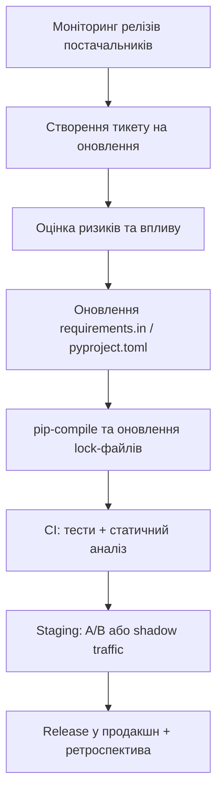

# Пінінг залежностей — можливі "сюрпризи" у продакшн через `>=`

Непридатне або агресивно оптимістичне визначення версій бібліотек у стилі
`package>=1.0` здається зручним, але залишає продакшн без передбачуваності.
Будь-який реліз, що задовольняє умову `>=`, може непомітно змінити поведінку
нашого застосунку. Цей документ описує, чому TradePulse вимагає точного пінінгу
залежностей, як виявляти ризики та які процеси зменшують “сюрпризи” під час
оновлень.

## Чому "вільні" версії небезпечні

| Симптом | Що відбувається | Наслідок |
| --- | --- | --- |
| **Приховані зміни API** | Новий мажорний реліз, що все ще відповідає `>=`,
  ламає контракт | Падіння пайплайнів, некоректні торгові сигнали |
| **Непередбачувані побічні ефекти** | Патчі додають поведінкові зміни без
  явного попередження | Накопичення технічного боргу, зростання MTTR |
| **Відмінності середовищ** | Розробники й CI підтягують різні версії залежно від
  часу встановлення | “Плаваючі” баги, що важко відтворити |
| **Локальні компроміси** | Тимчасові `pip install --upgrade` у розробників не
  відображені у lock-файлі | Відхилення від контрольованої конфігурації |

> **Нагадування:** навіть мінорні оновлення можуть містити зміну поведінки у
> математичних примітивах або в алгоритмах аналітики. Для торгівельної платформи
> TradePulse це напряму впливає на точність сигналів і довіру клієнтів.

## Принципи пінінгу у TradePulse

1. **Lock-файл — джерело істини.** `requirements.lock` та `requirements-dev.lock`
   формуються автоматично через `pip-compile` з `requirements.in`. Коміти без
   оновлення lock-файлів блокуються рев'юерами.
2. **Детерміновані білди.** Усі CI, staging і production-оточення встановлюють
   пакети виключно з lock-файлів. Ціль — біт-ідентичні артефакти.
3. **Безпечні вікна оновлень.** Планові апдейти залежностей збираються у
   керовані батчі, тестуються у staging і лише тоді переходять у production.
4. **Автоматизована валідація.** Перед мерджем обов’язкові юніт-, інтеграційні
   та регресійні тести запускаються на версіях з lock-файлу.

## Як переходити з `>=` на точні версії

1. **Виявити оптимістичні обмеження.** Використовуйте `pip-compile --upgrade
   --allow-unsafe` або статичний аналіз `pip-audit`/`poetry check` для пошуку
   гнучких вимог.
2. **Забезпечити зворотну сумісність.** Перед пінінгом перевіряйте changelog та
   release notes бібліотеки, з якою працюєте. Якщо потрібні нові фічі, спочатку
   забезпечте тестове покриття.
3. **Зафіксувати версію.** Оновіть `requirements.in` до `package==X.Y.Z` або
   еквівалентного формату у `pyproject.toml`. Згенеруйте lock-файл.
4. **Проконтролювати крос-мовні сервіси.** Для Rust/Go модулів застосовуйте ті ж
   принципи: `Cargo.lock`, `go.sum` зберігаються в репозиторії й оновлюються у
   межах одного PR.
5. **Комунікація.** Додайте нотатку в release-notes/backlog про зміни залежностей
   та потенційні наслідки.

## Політики оновлення

### Класифікація релізів

- **Патч-релізи (`X.Y.z`)**: збираються щомісяця, якщо проходять повний пакет
  тестів і профілювання продуктивності.
- **Мінорні (`X.y.Z`)**: потребують ручного рев’ю техліда, оновлення
  документації та сценаріїв відкату.
- **Мажорні (`x.Y.Z`)**: виконуються через RFC/ADR, з обов’язковим експериментом
  у канарейці й розробкою playbook'у відкату.

### Процес релізу залежностей

## Контроль та моніторинг

- **Dependabot / Renovate.** Використовуйте автогенерацію PR, але з ручним
  review кожного батчу.
- **SBOM та SCA.** Регулярно звіряйте lock-файли з Software Bill of Materials та
  сканерами вразливостей (наприклад, `pip-audit`, `safety`, `trivy`).
- **Сповіщення про CVE.** Впровадьте інтеграцію зі Slack/Teams, щоб команда
  отримувала попередження про критичні вразливості у зафіксованих версіях.
- **Пострелізний моніторинг.** Після оновлення уважно стежте за ключовими метриками:
  латентність сервісів, точність моделей, коректність торгових сигналів.

## Культура відповідальності

- **Коду-рев’ю:** зміни у залежностях вимагають двох апруверів, один з яких —
  відповідальний за сервіс.
- **Документація:** у `CHANGELOG.md` та внутрішніх runbook'ах фіксуйте
  критичні зміни версій.
- **Навчання:** щоквартальні воркшопи щодо безпечного оновлення залежностей та
  симуляції інцидентів через “зламані” релізи постачальників.

Дисциплінований пінінг дозволяє TradePulse розвиватися швидко, але без ризику
неочікуваних регресій. Контрольовані оновлення — це не бюрократія, а необхідний
бар'єр для стійкості торгової платформи.
