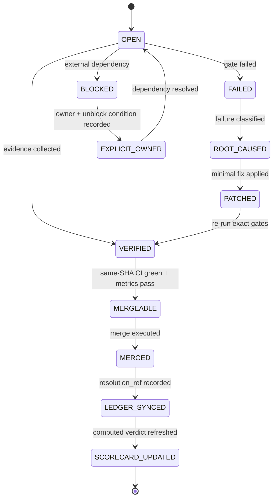
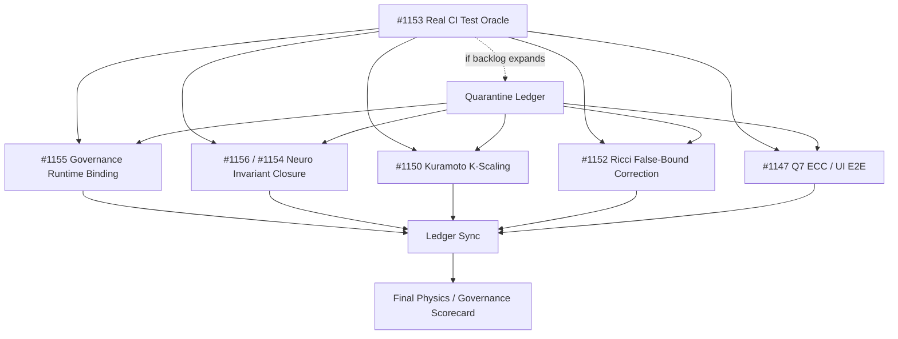
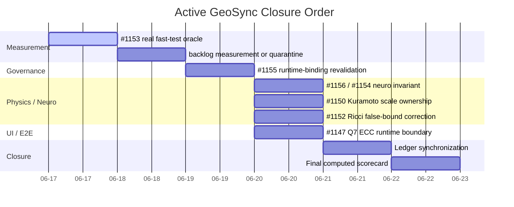
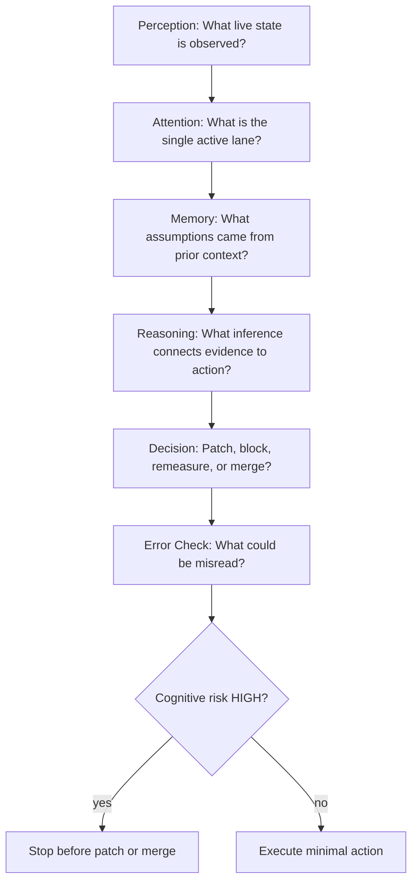
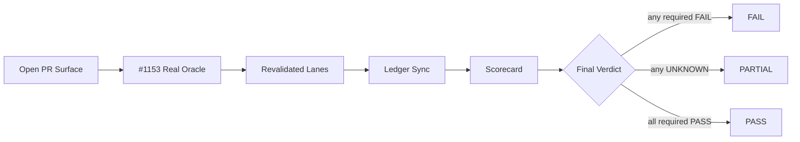

# Active GeoSync Closure Visualization

Status: coordination artifact.

Scope: operational visualization only. This document changes no runtime code, physics model, neuro validation, UI behavior, trading logic, or scientific claim.

Purpose: make the active closure protocol visually inspectable in a GitHub PR.

---

## 1. Terminal State Machine

---

## 2. Active PR Dependency Graph

Interpretation:

- #1153 is the measurement keystone.
- Dependent lanes must be revalidated after #1153 terminalizes or after an explicit quarantine plan exists.
- The final scorecard is downstream of ledger synchronization, not upstream prose.

---

## 3. Execution Lane Map

| Lane | PR | Responsible role | Primary object | Required proof | Stop condition |
| --- | ---: | --- | --- | --- | --- |
| Measurement | #1153 | Measurement Owner | real fast-test oracle | non-zero collected tests + fail-closed zero guard | CI terminal or measured backlog ledger |
| Governance | #1155 | Governance Runtime Owner | runtime-bound governance kernel | scoring loaded, executed, thresholded, weakest-link clamped | runtime-binding tests green |
| Neuro | #1156 / #1154 | Neuro Invariant Owner | dopamine/serotonin trajectory invariant | fail-before/pass-after trajectory tests | C-NEURO-003 resolved or explicitly blocked |
| Kuramoto | #1150 | Physics Boundary Owner | K-scaling ownership | ambiguous K path rejected, valid declared path accepted | scale ambiguity = 0 |
| Ricci | #1152 | Physics Boundary Owner | false curvature-bound removal | tests prevent reintroduction of false bound | descriptor/policy boundary preserved |
| Q7 | #1147 | UI/E2E Owner | ECC runtime proof | CI Playwright evidence or bounded local gap | ECC evidence recorded |
| Ledger | follow-up | Ledger Owner | canonical audit truth | JSON/Markdown agreement + resolution_ref | stale entries = 0 |
| Scorecard | final | Ledger Owner | computed verdict | PASS/PARTIAL/FAIL derived from metrics | no prose-only verdict |

---

## 4. Metrics v2 Heatmap

Legend:

- PASS: evidence satisfies target.
- PARTIAL: evidence exists but has bounded gap.
- FAIL: required proof missing or contradicted.
- UNKNOWN: measurement unavailable; caps lane verdict at PARTIAL.

| Metric | Owner | Source of truth | PASS | PARTIAL | FAIL |
| --- | --- | --- | --- | --- | --- |
| real_test_oracle | Measurement Owner | GitHub Actions + collection log | collected_tests > 0 and zero-collection guard active | known backlog quarantined | any shard passes 0/0 |
| ci_truth | All lane owners | same-SHA PR checks | all required checks green on head SHA | non-critical optional check bounded | stale SHA, skipped gate, pending required gate |
| governance_binding | Governance Runtime Owner | runtime tests | kernel loaded and executed | advisory-only path bounded | JSON artifact not executed |
| dead_invariants | Neuro Invariant Owner | validation code + tests | 0 declared-unchecked invariants | invariant blocked with owner | config declares invariant without validation path |
| physics_ambiguity | Physics Boundary Owner | invariant/equivalence tests | ambiguity count = 0 | documented future capability gap | silent K scaling or false Ricci bound remains |
| ecc_runtime | UI/E2E Owner | CI Playwright / route specs | ECC >= 0.90 with runtime proof | local gap explicitly bounded | ECC claim without runtime proof |
| ledger_staleness | Ledger Owner | audit JSON + Markdown | stale entries = 0 | pending entry has explicit owner | merged PR listed as IN_PROGRESS |
| quarantine_integrity | Measurement Owner | quarantine ledger | every entry has owner, issue, expiry | limited temporary quarantine | hidden failures or unowned quarantine |
| cognitive_risk | Acting agent | cognitive gate | LOW/MEDIUM with mitigation | MEDIUM with explicit risk | HIGH before patch/merge |
| final_verdict_integrity | Ledger Owner | scorecard test | verdict computed from metrics | PARTIAL due known gaps | PASS with any required FAIL/UNKNOWN |

---

## 5. Closure Timeline

Timeline semantics:

- Durations are placeholders for order, not calendar estimates.
- #1153 remains first because it restores the measurement instrument.
- Final scorecard starts only after active lanes are terminal or explicitly bounded.

---

## 6. Cognitive Evaluation Gate

Required pre-action questions:

| Cognitive dimension | Required question | Blocking condition |
| --- | --- | --- |
| Perception | Did I inspect current PR state, files, and CI? | acting from memory only |
| Attention | Is there exactly one selected lane? | multi-lane patch without collision map |
| Memory | Which assumptions are stale-risk? | relying on old green state |
| Reasoning | What proof converts observation into action? | inference lacks test or log evidence |
| Decision | What is the smallest valid state transition? | broad refactor or unrelated cleanup |
| Interpretation | What term could be overloaded? | metaphor treated as runtime proof |

---

## 7. Final Readiness Funnel

Readiness rule:

The final verdict cannot exceed the weakest required metric.

- Any required FAIL means FAIL.
- Any required UNKNOWN caps verdict at PARTIAL.
- PASS requires all required gates to be green on current evidence.
