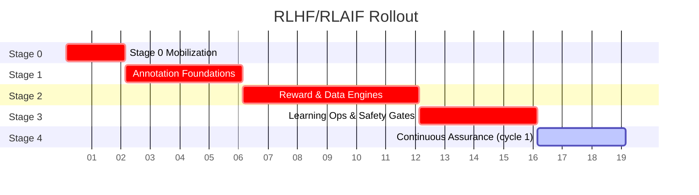
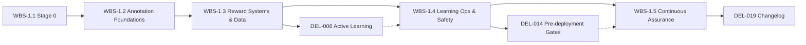

# RLHF/RLAIF Scope & Implementation Plan

## Overview
This plan instantiates the RLHF/RLAIF strategy for TradePulse into executable scope, WBS, and governance assets using the source specification in `docs/rlhf_rlaif_strategy.md`. It aligns phased delivery with annotation foundations, reward systems, learning operations, and continuous assurance mandated in Sections 2–14 of the artifact.【F:docs/rlhf_rlaif_strategy.md†L12-L142】

## Numbering & Naming Rules
- **WBS Codes**: `WBS-<phase>.<workstream>.<task>` where each dot level denotes increasing granularity. Phases map to implementation stages (0–4) from the rollout table.【F:docs/rlhf_rlaif_strategy.md†L138-L142】
- **Deliverables**: `DEL-###` aligned with chronological realization across the WBS hierarchy. Descriptions retain verbatim excerpts from the artifact for traceability.
- **Test References**: Each leaf WBS element references regression or governance tests that validate the deliverables it produces (see `scope/wbs.json` and `scope/deliverables.csv`).
- **Release Tags**: Formal releases adopt semantic versions `v<major>.<minor>` synchronized with `docs/alignment/changelog.md` updates (see governance tasks WBS-1.5.2–WBS-1.5.3 and DEL-019).

## Scope Boundaries
### In Scope
- Розробка та двомовне затвердження посібника «RLHF Annotation Guide».【F:docs/rlhf_rlaif_strategy.md†L12-L19】
- Шаблони анотацій, YAML-схеми та метрики узгодженості включно з Cohen’s Kappa і Krippendorff’s Alpha.【F:docs/rlhf_rlaif_strategy.md†L41-L47】
- Багаторівневі оцінювачі, активне навчання, self-reflection, винагороди й безпечні обмеження.【F:docs/rlhf_rlaif_strategy.md†L49-L88】
- Симулятори користувачів, scorecards, навчальні цикли RLHF/RLAIF та передвиробничі перевірки.【F:docs/rlhf_rlaif_strategy.md†L89-L121】
- Регресійні тести, MLOps-пайплайни, версіонування, аудити та ведення changelog.【F:docs/rlhf_rlaif_strategy.md†L123-L133】

### Out of Scope
- Подальші ініціативи з розширення RLAIF на мультимодальні дані, federated learning та ESG-аналітику розглядаються як наступні етапи за межами поточного WBS.【F:docs/rlhf_rlaif_strategy.md†L145-L148】

### TBD Items
- TBD-001: Чи охоплює поточний проєкт підтримку реального часу для human-in-the-loop під час критичних сесій трейдингу? (Потрібно підтвердити, оскільки пункт позначено як подальший розвиток у специфікації).【F:docs/rlhf_rlaif_strategy.md†L147-L148】

## Assumptions
1. Стартова дата програми — 2024-01-01 для планування графіка; зміни відображаються через changelog при фактичному коригуванні.【F:docs/rlhf_rlaif_strategy.md†L138-L142】
2. Інфраструктура Prefect/Kubeflow, DVC/MLflow та дані симуляторів доступні до початку відповідних WBS-гілок.【F:docs/rlhf_rlaif_strategy.md†L89-L132】
3. Регуляторні політики й аудитори надають доступ до матеріалів згідно з вимогами безпеки.【F:docs/rlhf_rlaif_strategy.md†L82-L87】【F:docs/rlhf_rlaif_strategy.md†L132】

## Schedule & Critical Path

The critical path spans Stages 0–3, with Stage 4 operating as a repeating governance cycle after initial stand-up.

## Dependency Network

Arrows show mandatory predecessors; dashed feedback loops highlight governance obligations feeding subsequent stages.

## Deliverable Traceability & Quality Gates
- Each deliverable in `scope/deliverables.csv` cites originating specification lines and maps to one or more WBS tasks to ensure no orphaned outputs.
- Quality criteria leverage score thresholds, regression baselines, and compliance approvals matching the artifact’s requirements for agreement metrics, Sharpe improvements, constrained RL, and audit trails.【F:docs/rlhf_rlaif_strategy.md†L45-L132】
- DEL→WBS→Test relationships are codified through `TestReferences` columns and `test_refs` fields in `scope/wbs.json`, enabling automated enforcement via the validation script.

## Release & Change Control
- Releases occur upon completion of Stage 3 checkpoints and successful Stage 4 regression sweep, generating a signed changelog entry with SHA256 checksums (WBS-1.5.3, DEL-019).【F:docs/rlhf_rlaif_strategy.md†L118-L133】
- Change requests trigger update of `scope/wbs.json`, `scope/deliverables.csv`, and `docs/alignment/changelog.md`, followed by rerunning `scope/validate_scope.py` to confirm numbering, ownership, and traceability remain intact.
- Approval workflow: QA Lead validates regression evidence, Compliance Lead signs governance artifacts, Documentation Lead records the release per DoD statements.

## Verification & Reproducibility
1. Execute `python scope/validate_scope.py` to assert weekly task granularity, owner presence, deliverable linkage, and citation format.
2. Run referenced automated tests to evidence DoD completion before moving to the next stage.
3. Maintain git transparency by committing scoped artifacts and updating changelog per release; include checksum outputs when publishing releases.

## Governance & Risk Notes
- Key risks include data latency for active sampling, policy drift, and audit scheduling; mitigation actions are embedded in Stage 2–4 WBS descriptions and DoD criteria.【F:docs/rlhf_rlaif_strategy.md†L57-L133】
- Security escalation triggers follow the bilingual instruction and scorecard alert requirements to maintain compliance posture.【F:docs/rlhf_rlaif_strategy.md†L18-L19】【F:docs/rlhf_rlaif_strategy.md†L100-L101】
- Continual improvement draws on quarterly audits and changelog analytics to adjust scope while preserving traceability.【F:docs/rlhf_rlaif_strategy.md†L132-L133】
